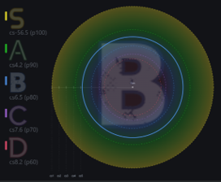

# osu! Radar：基于历史replay给玩家aim建模

中文 | [English](docs/en/README.md)

> 暂时只支持osu! stable。

使用简单的条件概率模型，估计玩家在某一map上的aim偏移分布及rank。估计结果会以网页形式绘制雷达图+rank，可在obs中打开。



估计结果可以这样表述：

> **在ar=x、sr=y的图上，当地图为cs z时，玩家将能aim到n%的object**（按ar、sr合计）
>
> **在cs=z、sr=y的图上，玩家将能aim到n%的object**（按cs、sr合计）

借助tosu读取图的四维来确定输入的x和y。

- 按object加权：长谱面贡献更多样本
- EZ/HR/DT先折算为等效CS/AR，SR用rosu-pp算实际值
- 这只是统计结论：n%是期望值，统计结论不能保证单例的情况

## 安装

本软件依赖[osu!stable](https://osu.ppy.sh/home/download)和[tosu](https://github.com/tosuapp/tosu)。

直接运行：

```sh
sh start.sh start
```

Windows运行：

```powershell
./start.ps1 start
```

首次运行需要冷启动1-5分钟全量分析历史replay，分析结果会缓存至sqlite数据库，后续只需热启数秒。

lazer不一定暴露内部replay因此迁移无望。

## 隐私

无数据外发，结果保存在本地。与 tosu 的通信全部是localhost。从replay目录通过复制调取replay，不修改任何osu文件。

## 估计算法

根据过往replay估测玩家aim落在一定偏移内的概率。

如果忽略pattern、difficulty、图的长度等因素，将所有replay的object当作整个集合，将对应帧上光标与object的距离作为aim偏移，并计算在概率空间上的分布，可以得到基础版模型：

> 当限定偏移区在cs x以内时，玩家将能aim到n%的object。

同理可得出p100/p90/p80/p70/p60，分别对应S/A/B/C/D rank所需的命中比例下限：低于该比例时，无论acc如何，期望rank都低于该rank。

**关键外推：忽略实际cs对玩家aim的影响**：

> 当地图为cs x时，玩家将能aim到n%的object。

（这个外推无疑是粗糙的，图的cs=2时玩家的移动一定比cs=5更随意，但到了一个cs阈值后，玩家就会感到力不从心，底力带来的偏移就会显示出来。但暂时忽略这两种因素的interplay，只考虑后者。）

而通过限定过往replay的ar/cs，可以得到同一ar/cs（不能同时：范围会太小）图上的aim偏移。这样，我们就得到了更强的命题，也就是开头的两种表述：

> **在ar=x的图上，当地图为cs y时，玩家将能aim到n%的object**（按ar合计）
>
> **在cs=y的图上，玩家将能aim到n%的object**（按cs合计）

**加入sr变量**

**在根据ar/cs统计的基础上，再按mod后sr ±0.5*选取接近的难度**：由于现代图ar集中在9-10，cs一般4-5，仅根据ar/cs无法评估图摆放难度的影响：例如，ar9.8-10这个天花板范围从7到10星都有，估测rank都一样显然不合理。

> **SR 口径**：rosu-pp计算的sr较stable内显示存在系统性偏低（官方算法持续变更中）。由于pooling的sr都是同口径的，不影响上面的建模预测，无伤大雅。